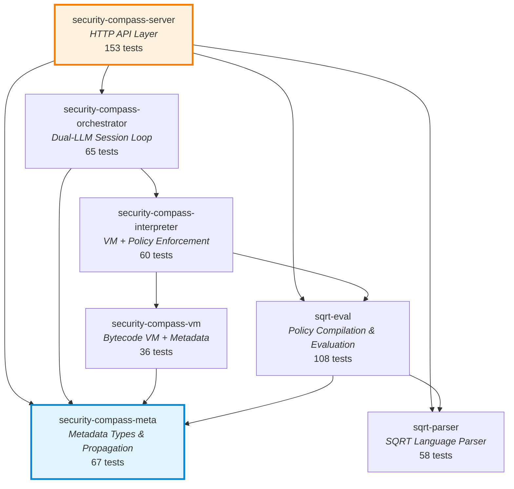
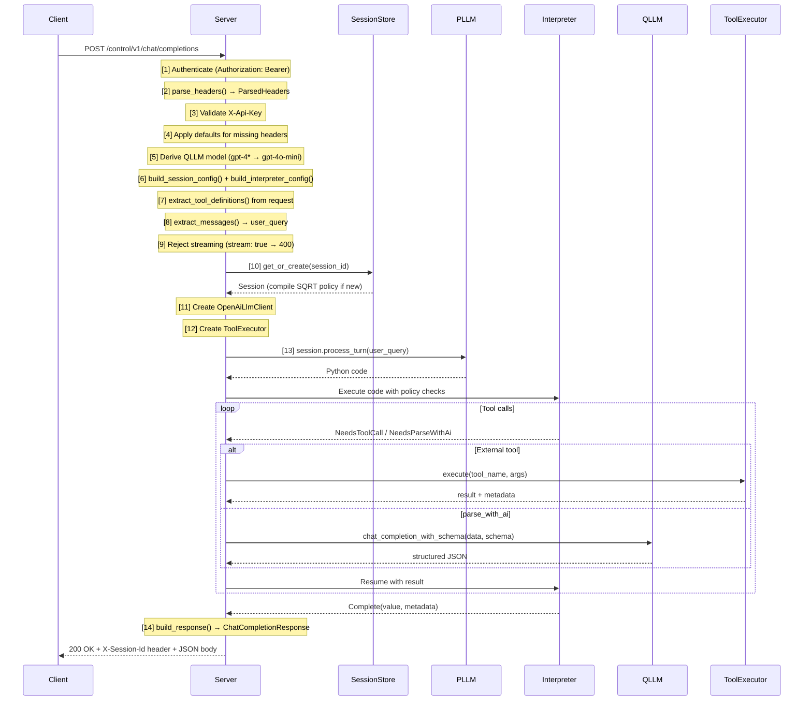
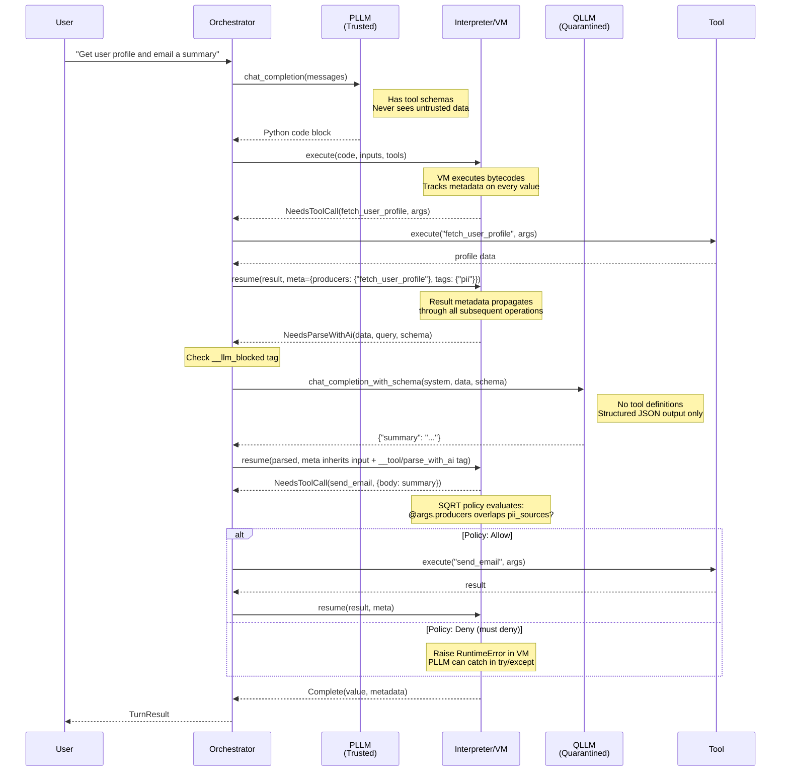
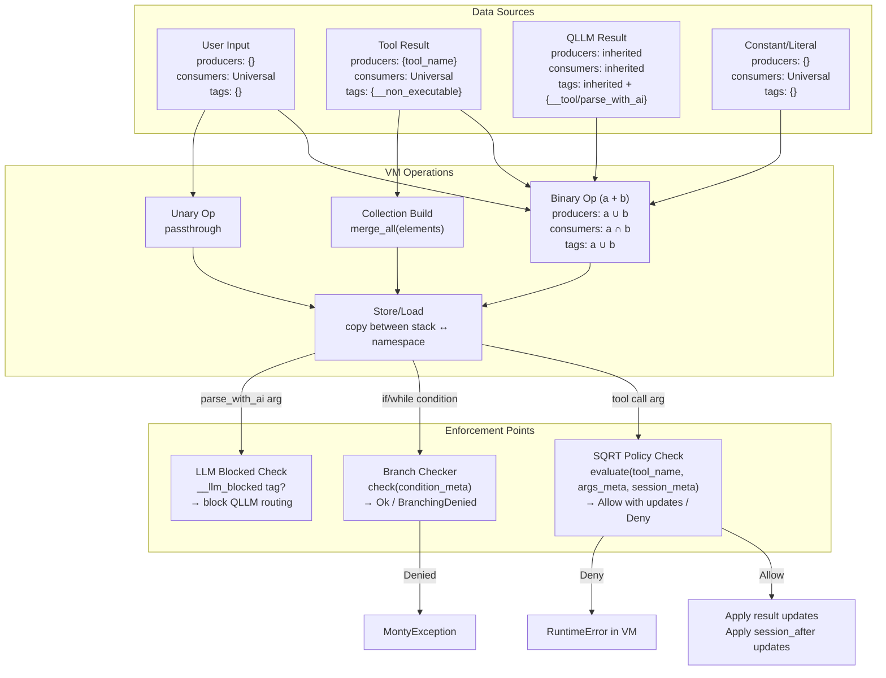
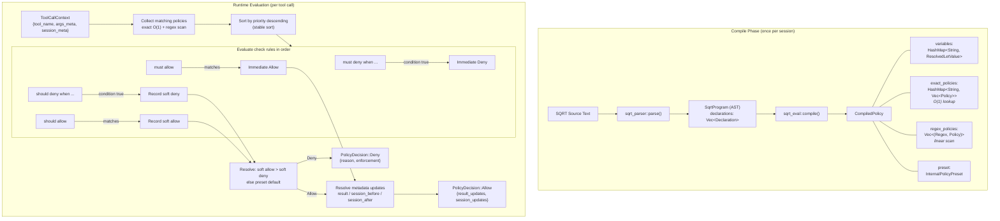
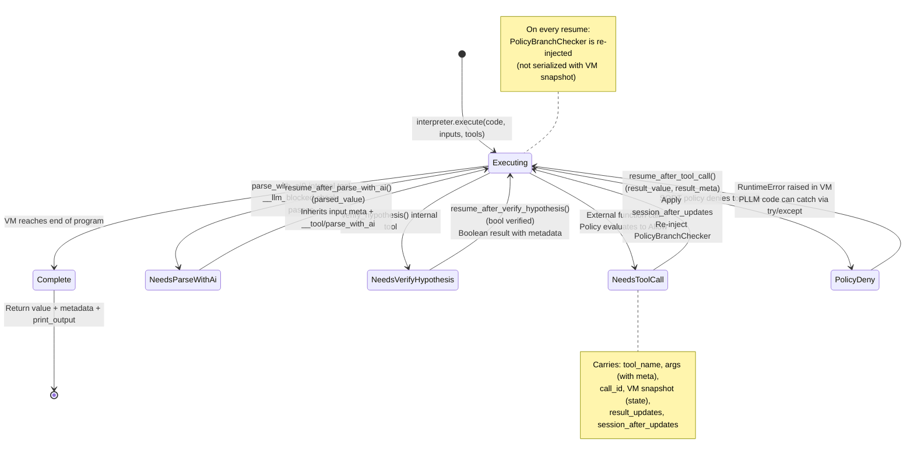

# System Diagrams

Mermaid diagrams visualizing the Security Compass Engine architecture. These render natively on GitHub.

## Table of Contents

1. [Crate Dependency Graph](#1-crate-dependency-graph)
2. [Request Processing Pipeline](#2-request-processing-pipeline)
3. [Dual-LLM Interaction Pattern](#3-dual-llm-interaction-pattern)
4. [Metadata Propagation](#4-metadata-propagation)
5. [SQRT Policy Evaluation](#5-sqrt-policy-evaluation)
6. [Session Lifecycle](#6-session-lifecycle)
7. [Interpreter Yield/Resume State Machine](#7-interpreter-yieldresume-state-machine)
8. [Security Boundaries](#8-security-boundaries)

---

## 1. Crate Dependency Graph

The workspace contains 7 crates arranged in a strict layered dependency hierarchy.
`security-compass-meta` is the shared foundation used by all layers.



---

## 2. Request Processing Pipeline

The 14-step HTTP request processing flow from client request to response.



---

## 3. Dual-LLM Interaction Pattern

How the PLLM (trusted) and QLLM (quarantined) interact through the Interpreter during a single turn. The PLLM generates code; the QLLM processes untrusted data with no tool-calling capability.



---

## 4. Metadata Propagation

Every value in the VM carries `Metadata` with three fields. Metadata propagates automatically through all bytecode operations and is checked at enforcement points.



---

## 5. SQRT Policy Evaluation

The policy system operates in two phases: compile-time optimization and runtime evaluation.



---

## 6. Session Lifecycle

Sessions are stored in a `DashMap` with TTL-based expiration and background eviction.

```mermaid
stateDiagram-v2
    [*] --> Creating: HTTP request<br/>(no session_id or unknown UUID)

    Creating --> Active: compile_policy()<br/>Session::new(policy, config, tools)

    Active --> Active: Next request arrives<br/>with valid X-Session-Id<br/>(refreshes TTL)

    Active --> Processing: process_turn()<br/>(DashMap RefMut held)

    Processing --> Active: TurnResult returned<br/>(Success / MaxAttemptsExceeded / Clarification)

    Processing --> Processing: Retryable error<br/>(VmException / PolicyViolation)<br/>PLLM retry loop

    Active --> Expired: TTL exceeded<br/>(default 1800s)

    Expired --> [*]: Background eviction task<br/>(runs every 60s)

    note right of Active
        Session state persists:
        - Interpreter (VM + policy + cache)
        - Message history
        - Turn count
        - Session metadata (tags, producers, consumers)
    end note

    note right of Processing
        Turn limit enforced:
        max_n_turns (default 5)
        Exceeded → MaxTurnsExceeded error
    end note
```

---

## 7. Interpreter Yield/Resume State Machine

The interpreter is synchronous with yield points. At each yield, it returns an `ExecutionResult` variant and suspends. The orchestrator performs async work, then resumes.



---

## 8. Security Boundaries

Eight security mechanisms operate at different layers of the architecture. No single layer is solely responsible -- an attacker must defeat all layers simultaneously.

```mermaid
graph LR
    subgraph Server["Server Layer"]
        AUTH["Session Isolation<br/><i>Each UUID → independent<br/>Interpreter, metadata, cache</i>"]
    end

    subgraph Orchestrator["Orchestrator Layer"]
        DUAL["PLLM/QLLM Separation<br/><i>PLLM: chat_completion() — trusted, has tools</i><br/><i>QLLM: chat_completion_with_schema() — no tools</i>"]
    end

    subgraph Interpreter["Interpreter Layer"]
        POLICY["Policy Enforcement<br/><i>SQRT evaluated before every tool call</i><br/><i>must deny is unoverridable</i>"]
        LLMBLK["LLM Blocked Tag<br/><i>__llm_blocked prevents<br/>routing to QLLM</i>"]
    end

    subgraph VM["VM Layer"]
        META_TRACK["Metadata Tracking<br/><i>Parallel stack_meta + namespace.metadata</i><br/><i>Every bytecode op maintains lockstep</i>"]
        BRANCH["Branching Protection<br/><i>BranchChecker at JumpIfTrue/JumpIfFalse</i><br/><i>Blocks untrusted data in control flow</i>"]
    end

    subgraph Meta["Metadata Foundation"]
        CONSUMER["Consumer Monotonicity<br/><i>Intersection only restricts, never loosens</i><br/><i>Finite({}) is absorbing</i>"]
        NONEXEC["Non-Executable Memory<br/><i>__non_executable tag on tool results</i><br/><i>Propagates through all operations</i>"]
    end

    Server --> Orchestrator --> Interpreter --> VM --> Meta

    style Server fill:#e8f5e9,stroke:#2e7d32
    style Orchestrator fill:#e3f2fd,stroke:#1565c0
    style Interpreter fill:#fff3e0,stroke:#e65100
    style VM fill:#fce4ec,stroke:#c62828
    style Meta fill:#f3e5f5,stroke:#6a1b9a
```



---

## Reading Guide

| If you want to understand... | See diagram |
|------------------------------|-------------|
| How the crates fit together | [1. Crate Dependency Graph](#1-crate-dependency-graph) |
| What happens when a request arrives | [2. Request Processing Pipeline](#2-request-processing-pipeline) |
| How PLLM and QLLM cooperate safely | [3. Dual-LLM Interaction Pattern](#3-dual-llm-interaction-pattern) |
| How data provenance is tracked | [4. Metadata Propagation](#4-metadata-propagation) |
| How security policies are compiled and enforced | [5. SQRT Policy Evaluation](#5-sqrt-policy-evaluation) |
| How sessions are managed | [6. Session Lifecycle](#6-session-lifecycle) |
| How the interpreter suspends and resumes | [7. Interpreter Yield/Resume](#7-interpreter-yieldresume-state-machine) |
| Where security is enforced | [8. Security Boundaries](#8-security-boundaries) |
